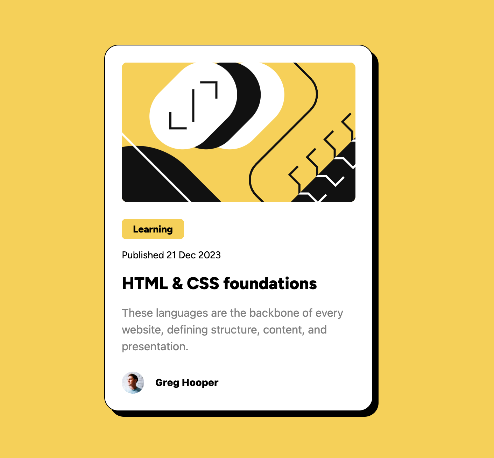
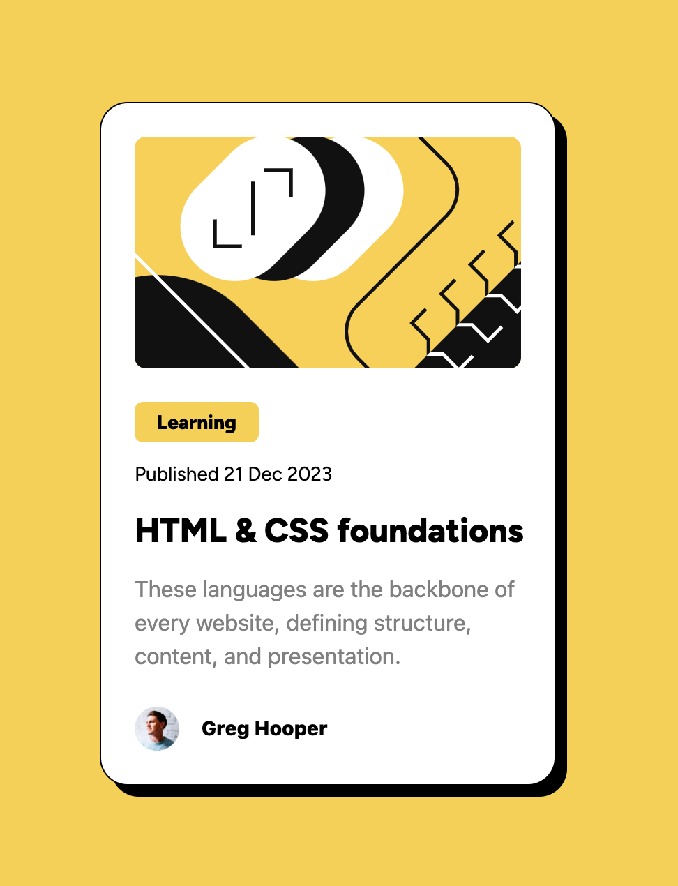

# Frontend Mentor - Blog preview card solution

This is a solution to the [Blog preview card challenge on Frontend Mentor](https://www.frontendmentor.io/challenges/blog-preview-card-ckPaj01IcS). Frontend Mentor challenges help you improve your coding skills by building realistic projects. 

## Table of contents

- [Overview](#overview)
  - [The challenge](#the-challenge)
  - [Screenshot](#screenshot)
  - [Links](#links)
- [My process](#my-process)
  - [Built with](#built-with)
  - [What I learned](#what-i-learned)
- [Author](#author)

**Note: Delete this note and update the table of contents based on what sections you keep.**

## Overview

### The challenge

Users should be able to:

- See hover and focus states for all interactive elements on the page

### Screenshot




### Links

- Solution URL: https://github.com/abhi02495/002_BlogPreviewCard
- Live Site URL: https://abhi02495.github.io/002_BlogPreviewCard/

## My process

### Built with

- Semantic HTML5 markup
- TailwindCSS

### What I learned

```html
<!-- below example is of transition-->
<p class="ml-6 font-figtree font-bold text-heading mb-3 hover:text-yellow transition ease-in-out delay-150 cursor-pointer">
    HTML & CSS foundations
</p>

<!--check the dropshadow and responsiveness-->
<div role="blogcard" class="sm:w-96 w-[327px] h-auto rounded-[20px] bg-white border drop-shadow-[8px_8px_0_rgba(0,0,0,1)]">
```

## Author

- LinkedIn - [Abhishek](https://www.linkedin.com/in/abhishek-shubham-634101126/)
- Frontend Mentor - [@abhi02495](https://www.frontendmentor.io/profile/abhi02495)

